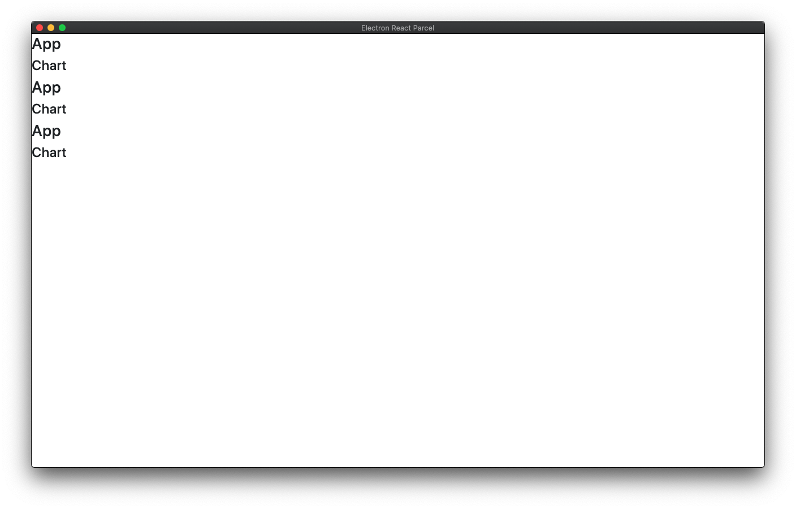

# Problem Integrating Tradingview Chart Library into React Electron App

## To Reproduce:

1. `yarn`
2. `yarn start`

## Error:

React tries to render the entire app an infinite number of times instead of just once.

## Environment

| Software         | Version(s) |
| ---------------- | ---------- |
| Parcel           | 1.12.4
| Node             | v14.0.0
| Yarn             | 1.22.4
| Operating System | Mac OS X Catalina 10.15.3